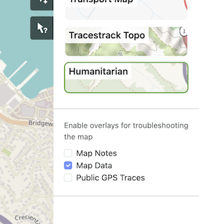

# popmap

GHSL Population data tools

source of data https://ghsl.jrc.ec.europa.eu/download.php?ds=pop

Using the 2020 WGS84 30 arcsec data

docs on data https://ghsl.jrc.ec.europa.eu/documents/GHSL_Data_Package_2023.pdf?t=1698413418

## open streetmap data

General open streetmap browser https://www.openstreetmap.org/

Turn on map data to hunt around for types.

 

browser for osm admin boundaries https://osm-boundaries.com/Map
nyc osm id is 175905
paris https://www.openstreetmap.org/relation/71525 or https://www.openstreetmap.org/relation/5814660

Use osmdata function getbb('Marin County, CA') to get the bounding box for Marin

## Nadieh Bremer's Lofoten map writeup

https://www.visualcinnamon.com/2023/04/personal-map-norway-with-javascript/
